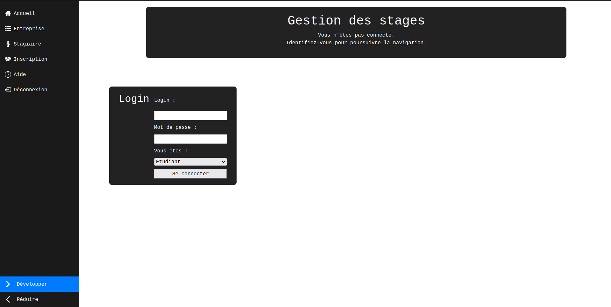
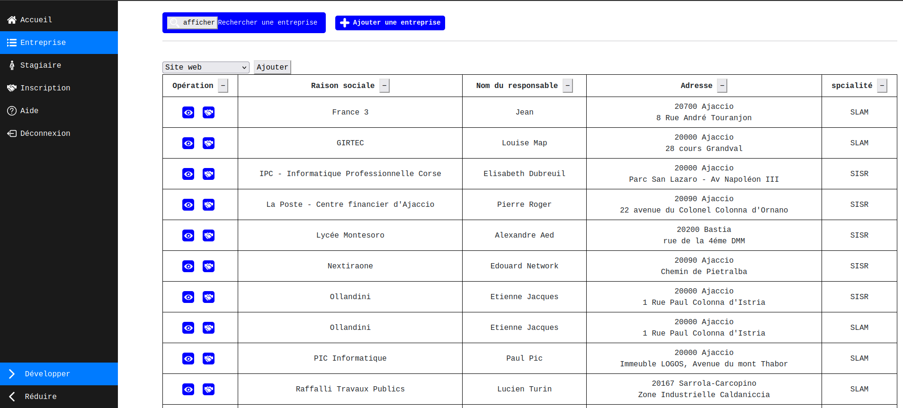
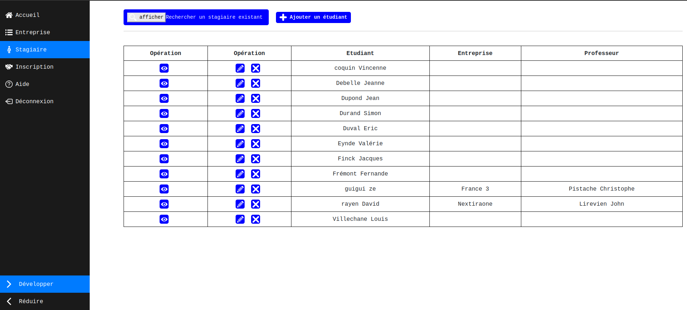
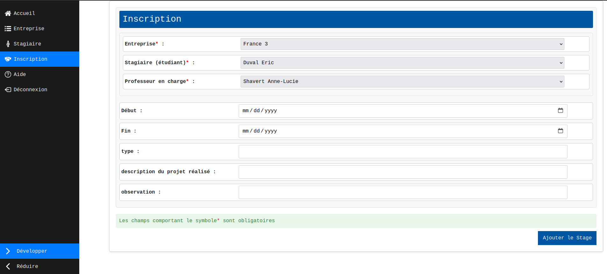

# 📘 Application de Suivi de Stage

## 📌 Présentation

Cette application web permet de gérer le suivi des stages des étudiants en entreprise.  
Elle a été développée en **PHP**, avec le moteur de templates **Twig**, le framework CSS **Bootstrap 5**, et une base de données **MySQL**.

---

## 🛠️ Fonctionnalités principales

### 🔐 Authentification
- Système d’authentification avec 2 types de profils :
  - **Professeur**
  - **Étudiant**
- Les droits et les vues sont adaptés selon le rôle connecté.
  


---

### 🏢 Gestion des Entreprises
- Ajouter une entreprise.
- Rechercher des entreprises selon plusieurs critères (filtrage dynamique).
- Afficher/masquer dynamiquement les colonnes du tableau.
- Modifier ou supprimer une entreprise existante.
- Visualiser les détails complets d’une entreprise.

- vue du professeur
    

- vue de l'étudiant
  

---

### 👨‍🎓 Gestion des Étudiants (Stagiaires)
- Rechercher un stagiaire selon différents filtres.
- Inscrire un étudiant à un stage via formulaire ou entreprise.
- Modifier ou supprimer les informations d’un étudiant.
- Accéder à la fiche complète du stagiaire.

 


---

### 📝 Formulaire d'Inscription
- Accessible au professeurs et aux étudiants.
- Permet de :
  - Renseigner les informations personnelles (nom, prénom, email, téléphone...).
  - Choisir une entreprise existante.
  - Renseigner les informations relatives au Stage.
- Validation et insertion en base de données après soumission.



---

## 🧱 Architecture technique

L'application repose sur une architecture **MVC simplifiée** :

```
/config          → Fichiers de configuration (DB, routes)
/public          
├── captures     → Captures d'écran du projet
├── css          → Feuilles de styles CSS
├── icons        → Icônes du projet
├── js           → Scripts JavaScript
└── index.php    → Point d'entrée principal
/src             
├── Controller   → Contrôleurs (logique applicative PHP)
├── Model        → Modèles de données (représentation des entités)
└── Vue          → Vues en Twig (affichage)
/vendor          → Dépendances PHP gérées par Composer
composer.json    → Fichier des dépendances
composer.lock    → Verrouillage des versions
README.md        → Documentation du projet
```

---

## 🗃️ Base de données

### 📚 Structure générale

L'application repose sur une base de données **relationnelle** MySQL organisée autour des principales entités suivantes :

| Table              | Description |
|--------------------|-------------|
| **classe**          | Gère les différentes classes d'étudiants. |
| **entreprise**      | Contient les informations sur les entreprises partenaires. |
| **etudiant**        | Gère les informations des étudiants/stagiaires. |
| **professeur**      | Liste les professeurs responsables du suivi. |
| **stage**           | Contient les détails des stages réalisés par les étudiants. |
| **mission**         | Représente des missions associées aux stages. |
| **specialite**      | Répertorie les spécialités d'activité. |
| **spec_entreprise** | Associe les entreprises aux spécialités. |
| **prof_classe**     | Gère l'affectation des professeurs aux classes. |

---

## 🧪 Installation locale

### ✨ 1. Environnement requis
- PHP 8 ou version ultérieure
- MySQL
- Serveur Apache
- Composer

### 🔍 2. Clonage du projet
Clonez le dépôt sur votre machine locale :
```bash
git clone https://github.com/RayBA22/Internship-Manager.git
```

### 🔹 3. Configuration
- Démarrez votre serveur **Apache** et votre service **MySQL**.
- Créez une base de données nommée **`suivi_stage`** via PhpMyAdmin ou en ligne de commande.
- Importez le fichier SQL fourni :
  - Chemin : `sql/suivi_stage.sql`
  - Cela créera automatiquement les tables nécessaires.

---


## 💻 Technologies utilisées

- **PHP 8** (PDO)
- **Twig** (moteur de templates)
- **Bootstrap 5** (CSS)
- **MySQL** (base de données relationnelle)
- **Composer** (gestionnaire de dépendances PHP)

---

## 🚧 Difficultés rencontrées

- Gestion complexe des droits utilisateur selon le rôle.
- Dynamisme des colonnes dans les tableaux des entreprises.
- Intégration fluide de Twig avec du Bootstrap et du PHP.

---

## 📂 Arborescence du projet

```
├── public/
│   ├── captures/
│   ├── css/
│   ├── icons/
│   ├── js/
│   └── index.php
├── src/
│   ├── Controller/
│   ├── Entity/
│   ├── Manager/
│   └── View/
│       └── templates/
├── config/
│   └── database.php
├── sql/
│   └── suivi_stage.sql
├── vendor/
├── composer.json
└── README.md
```

---

## 🧰 Comptes de test

- **Professeur**
  - Login : `di_pro01`
  - Mot de passe : `di_pro01`

- **Étudiant**
  - Login : `dupjea01`
  - Mot de passe : `dupjea01`
  
---

## 📝 Auteur

Projet réalisé  par **Ben Ammar Rayen**  
**ISI1-WEB**  2024-2025  
**Polytech Lyon**

